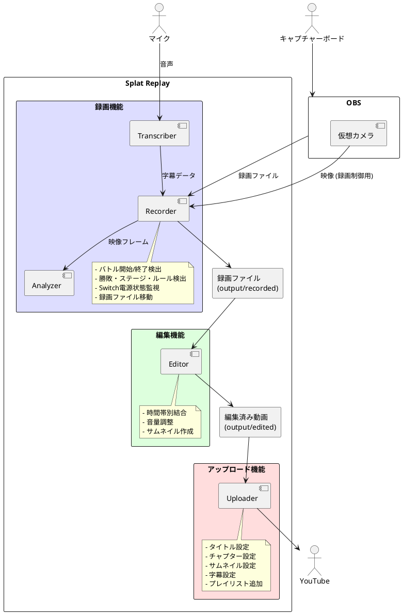
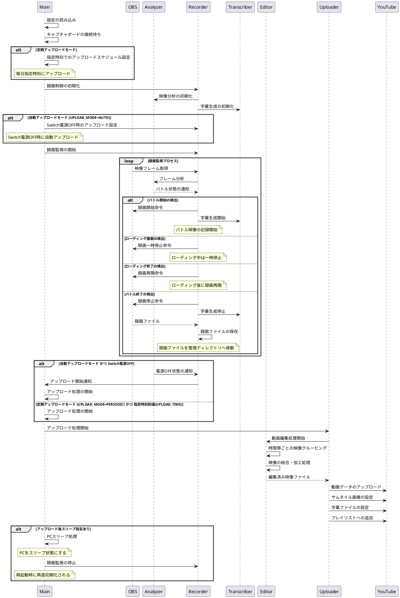

# Splat Replay 仕様書

このドキュメントは、Splat Replay システムの技術的な設計情報を提供します。開発者が機能追加や改造を行う際の参考資料です。

## 目次

- [1. システム概要](#1-システム概要)
  - [1.1 主な機能](#11-主な機能)
  - [1.2 システムアーキテクチャ](#12-システムアーキテクチャ)
- [2. システムフロー](#2-システムフロー)
  - [2.1 データフロー図](#21-データフロー図)
  - [2.2 制御フロー図](#22-制御フロー図)
- [3. ファイル構成](#3-ファイル構成)
- [4. 外部インターフェース](#4-外部インターフェース)
  - [4.1 ハードウェアインターフェース](#41-ハードウェアインターフェース)
  - [4.2 ソフトウェアインターフェース](#42-ソフトウェアインターフェース)
    - [4.2.1 OBS Studio](#421-obs-studio)
    - [4.2.2 YouTube API](#422-youtube-api)
    - [4.2.3 FFmpeg](#423-ffmpeg)
  - [4.3 設定インターフェース](#43-設定インターフェース)
- [5. コンポーネント詳細設計](#5-コンポーネント詳細設計)
  - [5.1 共通基盤コンポーネント](#51-共通基盤コンポーネント)
    - [5.1.1 Main コンポーネント](#511-main-コンポーネント)
  - [5.2 録画機能コンポーネント](#52-録画機能コンポーネント)
    - [5.2.1 Recorder コンポーネント](#521-recorder-コンポーネント)
    - [5.2.2 Analyzer コンポーネント](#522-analyzer-コンポーネント)
    - [5.2.3 Transcriber コンポーネント](#523-transcriber-コンポーネント)
  - [5.3 編集機能コンポーネント](#53-編集機能コンポーネント)
    - [5.3.1 Editor コンポーネント](#531-editor-コンポーネント)
  - [5.4 アップロード機能コンポーネント](#54-アップロード機能コンポーネント)
    - [5.4.1 Uploader コンポーネント](#541-uploader-コンポーネント)

## 1. システム概要

Splat Replay は、Nintendo Switch のゲームプレイを自動録画し、編集・アップロードするシステムです。特に Splatoon 3 のバトル映像を自動的に録画し、YouTube に投稿する機能に特化しています。

### 1.1 主な機能

- バトル開始・終了の自動検出による録画
- バトル結果（勝敗、キル数など）の自動解析
- 時間帯ごとのバトル映像の自動編集
- YouTube への自動アップロード
- 字幕生成（オプション機能）

### 1.2 システムアーキテクチャ

システムは以下の 3 つの主要機能で構成されています：

1. **録画機能**

   - `Recorder` - 録画処理と制御
   - `Analyzer` - ゲーム映像の分析
   - `Transcriber` - 音声認識と字幕生成（オプション）

2. **編集機能**

   - `Editor` - 録画された動画の編集処理

3. **アップロード機能**
   - `Uploader` - 動画のアップロード処理

## 2. システムフロー

### 2.1 データフロー図



### 2.2 制御フロー図



## 3. ファイル構成

- **録画済みファイル**: `output/recorded`ディレクトリに保存
- **編集済みファイル**: `output/edited`ディレクトリに保存
- **アセット**: `assets`ディレクトリに保存
  - サムネイル用素材: `assets/thumbnail`ディレクトリ
  - テンプレート画像: `assets/templates`ディレクトリ
  - 用語集: `assets/glossary.txt`ファイル

## 4. 外部インターフェース

### 4.1 ハードウェアインターフェース

- **キャプチャーボード**: USB 接続のキャプチャーボード（環境変数で設定）
- **マイク**: 音声認識用のマイクデバイス（オプション、環境変数で設定）

### 4.2 ソフトウェアインターフェース

#### 4.2.1 OBS Studio

- WebSocket 経由で制御
- キャプチャーボードからの映像入力
- 仮想カメラ機能による映像出力
- 録画の開始/停止制御
- ファイルの直接保存

#### 4.2.2 YouTube API

- 動画のアップロード
- タイトル、説明、サムネイル画像の設定

#### 4.2.3 FFmpeg

- 複数動画ファイルの結合
- 音量調整
- 字幕ファイルの埋め込み

### 4.3 設定インターフェース

設定は環境変数（.env ファイル）で管理:

```
# キャプチャー設定
CAPTURE_DEVICE_NAME=Your Capture Device Name  # キャプチャーデバイスの名前
CAPTURE_DEVICE_INDEX=0  # キャプチャーデバイスのインデックス
CAPTURE_WIDTH=1920  # キャプチャー解像度（横）
CAPTURE_HEIGHT=1080  # キャプチャー解像度（縦）

# OBS設定
OBS_PATH=C:\Program Files\obs-studio\bin\64bit\obs64.exe  # OBSの実行ファイルパス
OBS_WS_HOST=localhost  # WebSocket接続先ホスト
OBS_WS_PORT=4444  # WebSocketポート
OBS_WS_PASSWORD=yourpassword  # WebSocketパスワード

# マイク設定（オプション）
MIC_DEVICE=Your Microphone Name  # マイクデバイス名（字幕生成を使用する場合）

# アップロード設定
UPLOAD_MODE=AUTO  # AUTO（Switch電源OFF時）または PERIODIC（定時）
UPLOAD_TIME=23:00  # PERIODICモード時の時刻（HH:MM形式）
SLEEP_AFTER_UPLOAD=true  # アップロード後にPCをスリープするか

# YouTube設定
YOUTUBE_TITLE_TEMPLATE={BATTLE}({RATE}) {RULE} {WIN}勝{LOSE}敗 {DAY} {SCHEDULE}時～
YOUTUBE_DESCRIPTION_TEMPLATE={CHAPTERS}
YOUTUBE_CHAPTER_TITLE_TEMPLATE={RESULT} {KILL}k {DEATH}d {SPECIAL}s {STAGE}

# 音量設定
VOLUME_MULTIPLIER=1.0  # 音量調整係数

# Groq API設定（字幕生成で使用する場合）
GROQ_API_KEY=your_api_key
```

## 5. コンポーネント詳細設計

### 5.1 共通基盤コンポーネント

#### 5.1.1 Main コンポーネント

アプリケーションのエントリーポイントとして、全体のライフサイクルを管理します。

**主な機能**:

- 環境変数による設定のロード
- 録画・アップロードコンポーネントの初期化と連携
- アップロードスケジュールの設定と管理
- アップロード後の処理（PC スリープなど）

**動作モード**:

- **自動アップロードモード** (`UPLOAD_MODE=AUTO`): Switch 電源 OFF 時に自動アップロード
- **定期アップロードモード** (`UPLOAD_MODE=PERIODIC`): 指定時刻に定期的にアップロード

**アップロード後処理**:

- `SLEEP_AFTER_UPLOAD=true`の場合、PC をスリープ状態に移行
- スリープ後は Recorder を終了し、再接続時に自動的に再起動

### 5.2 録画機能コンポーネント

#### 5.2.1 Recorder コンポーネント

OBS の録画制御と状態管理を担当します。

**主な機能**:

- OBS の起動と WebSocket 経由での制御
- Analyzer の情報に基づく録画制御（開始・停止・一時停止・再開）
- 録画ファイルの管理
- Transcriber の制御
- Switch 電源状態の監視
- バトル結果の記録

**録画状態**:

- `OFF`: 録画停止中
- `WAIT`: 録画待機中
- `RECORD`: 録画中
- `PAUSE`: 録画一時停止中

#### 5.2.2 Analyzer コンポーネント

仮想カメラからの映像を分析し、ゲーム状態を判断します。

**主な機能**:

- フレームの前処理
- リアルタイム映像解析
- ゲーム状態の検出と Recorder への通知

**検知する情報**:

- バトル開始・終了タイミング
- バトル結果（勝敗）
- Switch 電源状態
- レート情報
- ルール・ステージ情報
- ローディング状態
- スケジュール変更
- マッチング開始

**解析手法**:

- テンプレートマッチング
- 色ヒストグラム分析
- OCR（光学式文字認識）
- 画像特徴量分析

#### 5.2.3 Transcriber コンポーネント

音声認識と字幕生成を担当します（オプション機能）。

**主な機能**:

- マイク入力からの音声認識
- 認識結果の字幕データへの変換
- スプラトゥーン用語の認識精度向上

**処理フロー**:

1. マイク入力のキャプチャ
2. 音声認識による文字列変換
3. 用語集による専門用語の補正
4. タイムスタンプ付き字幕データ生成
5. 録画映像への字幕関連付け

### 5.3 編集機能コンポーネント

#### 5.3.1 Editor コンポーネント

録画ファイルの編集を担当します。

**主な機能**:

- 時間帯別のファイルグルーピング
- 複数ファイルの結合
- 音量調整
- タイトル・説明文の生成
- サムネイル画像の作成
- 字幕の結合

**サブコンポーネント**:

- **映像処理エンジン**: FFmpeg を用いた動画編集
- **サムネイル生成器**: 戦績画面からのサムネイル生成
- **メタデータ生成器**: タイトル、説明文、チャプターの生成

**時間帯グルーピング**:
録画ファイルは以下の時間帯でグルーピング:

- 1:00 - 3:00
- 3:00 - 5:00
- 5:00 - 7:00
- 7:00 - 9:00
- 9:00 - 11:00
- 11:00 - 13:00
- 13:00 - 15:00
- 15:00 - 17:00
- 17:00 - 19:00
- 19:00 - 21:00
- 21:00 - 23:00
- 23:00 - 1:00

### 5.4 アップロード機能コンポーネント

#### 5.4.1 Uploader コンポーネント

動画のアップロードを担当します。

**主な機能**:

- 動画アップロードの実行と監視
- メタデータの設定
- サムネイル画像の設定
- 字幕ファイルの設定
- プレイリストへの追加

**アップロード起動方法**:

- **自動起動**: Switch 電源 OFF 検知時
- **定期起動**: 指定時刻（`UPLOAD_TIME`）に起動

**アップロードフロー**:

1. 編集済み動画ファイルの検出
2. YouTube API 認証
3. タイトル、説明文、サムネイル設定
4. チャプター情報生成・設定
5. アップロード実行と進捗監視
6. 字幕ファイル設定（オプション）
7. 公開状態設定
8. プレイリスト追加（必要に応じて）
9. アップロード完了後処理
